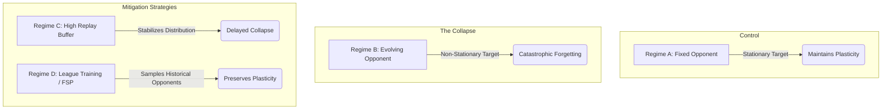

<div align="center">
  <h1>Loss of Plasticity in Continual Multi-Agent Reinforcement Learning</h1>
  <p><strong>Representation Collapse in Large Language Models under Zero-Sum Self-Play</strong></p>
</div>

---

## 🔬 Overview
This repository serves as the experimental harness for evaluating **Representation Collapse (Loss of Plasticity)** in Large Language Models (LLMs) when trained via continuous multi-agent reinforcement learning (MARL). 

While standard single-agent RL often operates in stationary environments, zero-sum self-play introduces a highly non-stationary target: the opponent is constantly evolving. We hypothesize that this endless cycle of chasing a moving target forces the LLM to aggressively churn its weights, ultimately resulting in a permanent loss of the network's ability to adapt (loss of plasticity). 

This repository tests this hypothesis on the `Qwen/Qwen2.5-0.5B-Instruct` model in complex imperfect-information games (Leduc Poker) and evaluates mechanisms like Fictitious Self-Play (League Training) and High Replay Buffers to mitigate the collapse.

## 📊 Experimental Regimes

To isolate the causes of plasticity collapse, we evaluate four distinct training regimes over 2,000 PPO/DAPO iterations.



## 📈 Tracking Plasticity & Collapse
We measure the degradation of the neural network's capacity by hooking into the LLM's final-layer hidden states during the generation of Chain-of-Thought (CoT) latents. We track three primary metrics:

1. **Feature Variance:** The variance of the activations in the final layer. A crash in feature variance represents a direct loss of representation capacity.
2. **Dormant Neurons:** The percentage of neurons that die (mean absolute activation `< 1e-3`).
3. **Policy Entropy:** Monitored to ensure the model does not fall into "Exploration Hacking" (collapsing to a degenerate, safe 0-entropy state). We explicitly force exploration via a $0.0$ entropy penalty and a high learning rate.

*We also track a **Safety Refusal Rate** (Red-Teaming Proxy) to evaluate if plasticity loss strictly correlates with a catastrophic forgetting of the model's pre-trained guardrails.*

## ⚙️ Installation

We provide an automated setup script (`install.sh`) that installs the environment (including OpenSpiel and TRL) for macOS (MPS) and Linux Servers (CUDA).

```bash
git clone https://github.com/Peddinti-Sriram-Bharadwaj/qwen_self_play.git
cd qwen_self_play

chmod +x install.sh
./install.sh
```

## 🚀 Running the Experiments (ICLR Targeted Runs)

The following commands execute the primary experimental loop designed to force the plasticity collapse on **Leduc Poker**. We use an aggressive learning rate (`--lr 1e-4`) and zero entropy penalty (`--beta 0.0`) to maximize gradient churn.

> [!TIP]
> **Server Management:**
> Use `htop -u $USER` to monitor your RAM/CPU usage. If you are on a shared server, use `nvidia-smi` to find a GPU with at least 15 GB of free VRAM before launching. Ensure you assign the correct GPU via `--llm-gpu <ID>`.

```bash
# Activate the environment
conda activate rl_sim

# Regime A: Fixed Opponent (Stationary Control Group)
nohup python -u main.py --algo DAPO --backend openspiel --env leduc_poker --regime A --iterations 2000 --seed 42 --lr 1e-4 --beta 0.0 --llm-gpu 0 > run_regime_A.log 2>&1 &

# Regime B: Self-Play (The Collapse Group)
nohup python -u main.py --algo DAPO --backend openspiel --env leduc_poker --regime B --iterations 2000 --seed 42 --lr 1e-4 --beta 0.0 --llm-gpu 0 > run_regime_B.log 2>&1 &

# Regime D: Historical Opponent Pool (Fictitious Self-Play)
nohup python -u main.py --algo DAPO --backend openspiel --env leduc_poker --regime D --iterations 2000 --seed 42 --lr 1e-4 --beta 0.0 --llm-gpu 0 > run_regime_D.log 2>&1 &

# Regime C: High Replay Buffer
nohup python -u main.py --algo DAPO --backend openspiel --env leduc_poker --regime C --iterations 2000 --seed 42 --lr 1e-4 --beta 0.0 --llm-gpu 0 > run_regime_C.log 2>&1 &
```

## 📚 Citations & Prior Work
This experimental harness and the implemented plasticity tracking metrics heavily reference the following prior work:
1. **Lyle et al. (2023):** *Understanding Plasticity in Neural Networks* ([arXiv:2303.07507](https://arxiv.org/abs/2303.07507)) - Identifies the loss of plasticity when models cycle through changing tasks.
2. **SPIRAL (2025):** Recent explorations linking representation collapse to continuous self-play in language models.
